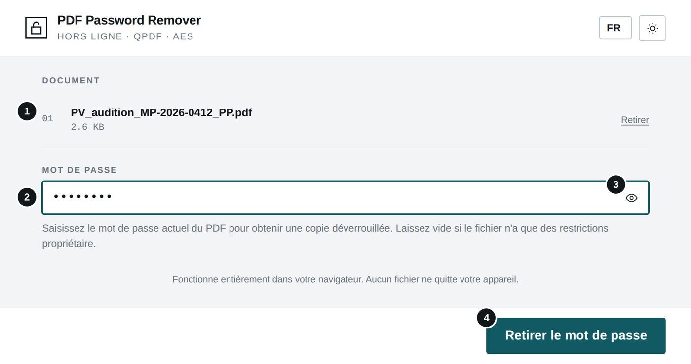
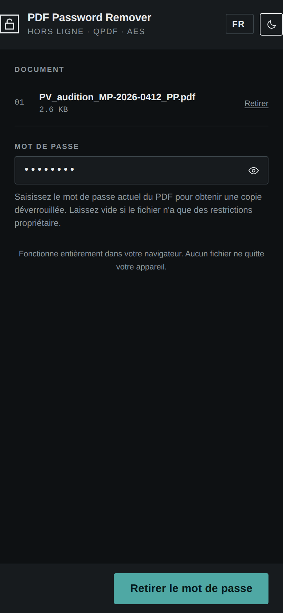
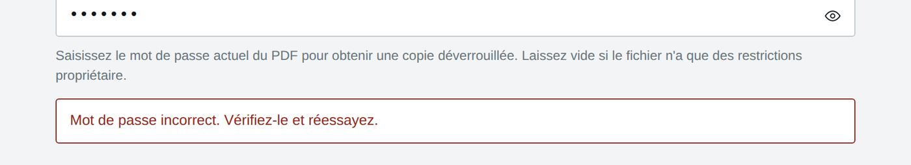
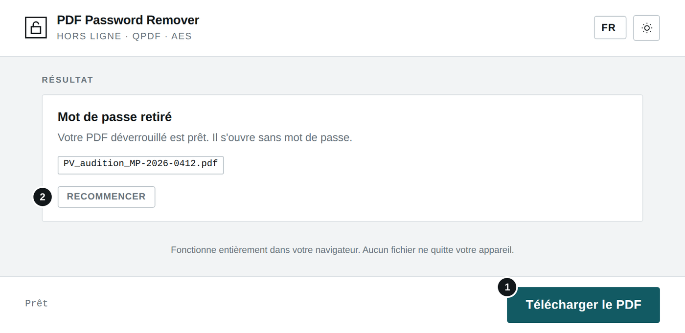
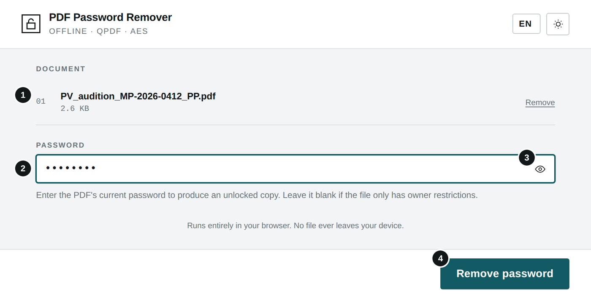
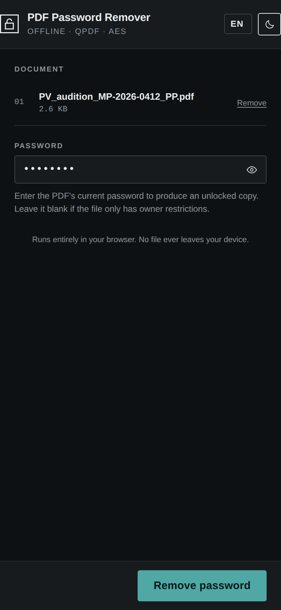
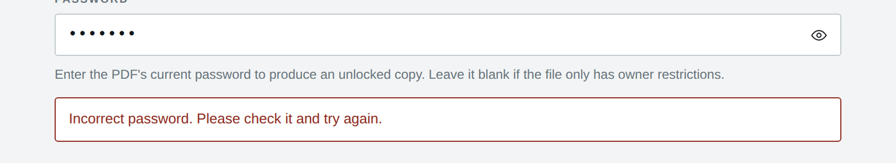
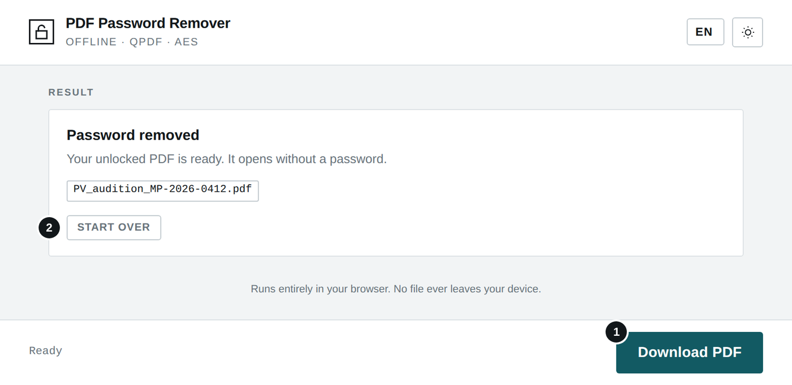

# PDF Password Remover

**`PDF_PASSWORD_REMOVER.html`** · Hors ligne · Aucune installation · Aucun envoi — *Offline · No install · No upload*

**[Français](#français) · [English](#english)**

---

## Français

### À quoi sert cet outil

Cet outil retire la protection d'un PDF dont vous connaissez le mot de passe et produit une copie déverrouillée, qui s'ouvre sans mot de passe. Il ne permet pas de retrouver un mot de passe inconnu.

### Avant de commencer

- Ouvrez le fichier PDF_PASSWORD_REMOVER.html par double-clic : il s'affiche dans votre navigateur (Chrome, Edge, Firefox ou Safari récents). Aucune installation n'est nécessaire.
- L'outil fonctionne sans connexion Internet. Aucun fichier n'est envoyé : tout le traitement se fait sur votre appareil.
- La langue (FR, EN, SW, LN) se choisit en haut à droite ; le bouton voisin bascule entre thème clair et sombre. Ces choix sont mémorisés.

### L'écran en un coup d'œil

1. Document sélectionné (« Retirer » pour en choisir un autre)
2. Mot de passe actuel du PDF
3. Afficher ou masquer le mot de passe
4. Retirer le mot de passe

#### Sur téléphone (thème sombre)

### Utilisation pas à pas

1. Cliquez sur « Choisir ou déposer un PDF ». L'outil traite un document à la fois.
2. Saisissez le mot de passe actuel, de préférence par copier-coller depuis Secret_Files_Password.txt. L'icône en forme d'œil permet de vérifier la saisie. Laissez le champ vide si le PDF n'a que des restrictions (impression, copie) sans mot de passe d'ouverture.
3. Cliquez sur « Retirer le mot de passe » ou appuyez sur Entrée.
4. Cliquez sur « Télécharger le PDF ». Un fichier dont le nom se termine par _PP retrouve son nom d'origine ; sinon, le suffixe _unlocked est ajouté.

### Résultat

*En cas d'erreur, un message indique la cause et le document reste sélectionné pour une nouvelle tentative.*

1. Télécharger le PDF déverrouillé
2. Recommencer avec un autre document

*Écran de fin.*

### Bonnes pratiques

- Le mot de passe respecte majuscules, minuscules et caractères spéciaux. Lors d'un copier-coller, attention aux espaces ajoutés avant ou après.
- Ne conservez la copie déverrouillée que le temps nécessaire, puis supprimez-la.
- N'utilisez l'outil que pour des documents que vous êtes autorisé à ouvrir.

### En cas de problème

| Problème | Solution |
|---|---|
| **« Mot de passe incorrect »** | Vérifiez la saisie avec l'icône en forme d'œil, la casse et les espaces. Copiez-collez le mot de passe depuis la liste d'origine. |
| **« Impossible de traiter ce PDF »** | Le fichier est endommagé, n'est pas un vrai PDF, ou utilise un chiffrement non pris en charge. |
| **Le bouton reste grisé** | Aucun PDF n'est sélectionné. Choisissez d'abord un document. |

### Confidentialité

L'outil fonctionne entièrement sur votre appareil, sans connexion Internet. Aucune donnée n'est transmise ni conservée en dehors des fichiers que vous téléchargez vous-même.

---

## English

### What this tool is for

This tool removes the protection from a PDF whose password you know and produces an unlocked copy that opens without a password. It cannot recover an unknown password.

### Before you start

- Double-click PDF_PASSWORD_REMOVER.html: it opens in your browser (recent Chrome, Edge, Firefox or Safari). Nothing to install.
- The tool works without an Internet connection. No file is uploaded: everything is processed on your device.
- Choose the language (FR, EN, SW, LN) at the top right; the button next to it switches between light and dark theme. Both choices are remembered.

### The screen at a glance

1. Selected document (“Remove” to pick another)
2. Current PDF password
3. Show or hide the password
4. Remove password

#### On a phone (dark theme)

### Step by step

1. Click “Choose or drop a PDF”. The tool handles one document at a time.
2. Enter the current password, preferably by copy-paste from Secret_Files_Password.txt. The eye icon lets you check what you typed. Leave it blank if the PDF only has restrictions (printing, copying) and no opening password.
3. Click “Remove password” or press Enter.
4. Click “Download PDF”. A file ending in _PP gets its original name back; otherwise _unlocked is added.

### Result

*If something goes wrong, a message gives the reason and the document stays selected for another try.*

1. Download the unlocked PDF
2. Start over with another document

*End screen.*

### Good practice

- Passwords are case-sensitive and include special characters. When pasting, watch for extra spaces before or after.
- Keep the unlocked copy only as long as needed, then delete it.
- Only use the tool on documents you are authorised to open.

### Troubleshooting

| Problem | Solution |
|---|---|
| **“Incorrect password”** | Check with the eye icon, letter case and spaces. Copy-paste the password from the original list. |
| **“Could not process this PDF”** | The file is damaged, is not a real PDF, or uses unsupported encryption. |
| **The button stays greyed out** | No PDF is selected. Choose a document first. |

### Privacy

The tool runs entirely on your device, without an Internet connection. No data is sent or kept anywhere other than the files you download yourself.
